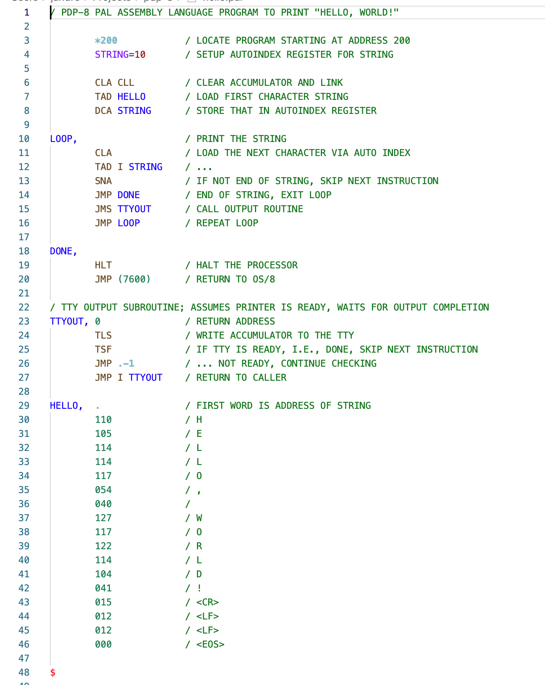

# pal8-syntax-vscode

https://marketplace.visualstudio.com/items?itemName=jeff-andre.pal8-syntax-vscode

This VS Code extension provides syntax highlighting for PDP-8 assembly language;
PAL-8/PAL-III/PAL-D, files (.PA, PAL, pal and .pa).

